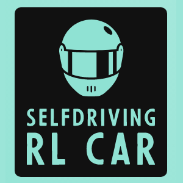
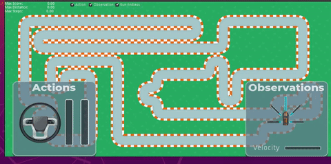
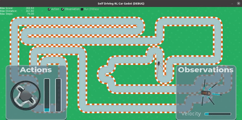

SelfDrivingRLCarGodot
=======

License: MIT

A Godot Project for a Self Driving Car Game using Reinforcement Learning (NeuroEvolution of Augmentin Topologies)




Introduction
------------

Trained agent after approx. 30min of training:


This project was meant as demo showcase how Godot Engine can be used as simulation environment for reinforcement learning.
The training algorithm itself is implemented in Python, which allows using most openly available implementations for machine learning applications (e.g. using PyTorch, Tensorflow, etc.).
At the same time, the easy to use Godot Engine allows quickly implementing 2D as well as 3D simulation environments that can be used for RL interactions.
 
The communication is very rudimentary implemented using TCP socket communication. In this example, Godot Engine is acting as server while the python code for trainings connects as client. This was intended to easily enable multi-agent training in parallel in one single simulation instance (as inspired by [Samuel Arzt](https://www.youtube.com/watch?v=Aut32pR5PQA "YouTube video from Samuel Arzt").
 
The algorithm used for training the agent is called NEAT and is based on the wonderful open-source package (neat-python from CodeReclaimers)[https://github.com/CodeReclaimers/neat-python]. No changes to the core-algorithm itself were made.


Requirements/Installation
------------

Tested with

- [Ubuntu 20.04](https://ubuntu.com/download/desktop/thank-you?version=20.04.2.0&architecture=amd64 "Ubuntu 20.04.2.0 LTS Download Link")
- [conda 4.9.2](https://www.anaconda.com/products/individual "Anaconda Download Page")
- [Godot 3.3.2](https://www.google.com "Godot Engine Download Page")

Get the newest sources from Github:
```bash
$ git clone https://github.com/JonathanSchmalhofer/SelfDrivingRLCarGodot
```

To install all dependencies with Anaconda run
```bash
$ cd SelfDrivingRLCarGodot\python\conda
$ conda env create -f environment.yml`
```

To verify the environment was created successfully run
```bash
$ conda env list
```
One of the rows should list an environment named `godot-sl-car`.

To activate the conda environment run
```bash
$ conda activate godot-sl-car
$ echo $CONDA_DEFAULT_ENV # this should output godot-sl-car
```


Start Training
------------

* Import and open and project in Godot from the subfolder `SelfDrivingRLCarGodot`. No changes should be needed, you can directly hit the "Play" button to start the simulation server.
* Open a new terminal and activate the conda environment using `$ conda activate godot-sl-car`.
* Change to the directory of the `gym_godot_car` python package `$ cd python/gym_godot_car`.
* Run the the script for training a feedforward network using NEAT `$ python train_neat_feedforward.py`
* Watch and Enjoy!

Last seconds of training process before the first agent manages to finish the course:



Acknowledgements
------------

* The idea for this project was inspired by [Samuel Arzt](https://www.youtube.com/watch?v=Aut32pR5PQA). Thank you very much for your contributions on [YouTube](https://www.youtube.com/c/SamuelArzt/videos).
* The entire NEAT-algorithm implementation was borrowed from (neat-python from CodeReclaimers)[https://github.com/CodeReclaimers/neat-python] and stripped down to a minimum for better understanding.
* One of the most entertaining and easy to understand (short) explanations of NEAT was provided by [SethBling](https://www.youtube.com/channel/UC8aG3LDTDwNR1UQhSn9uVrw) and his [MarI/O](https://www.youtube.com/watch?v=qv6UVOQ0F44) project.


